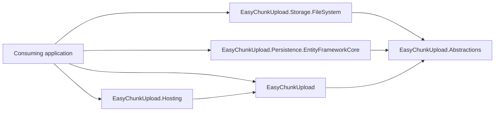
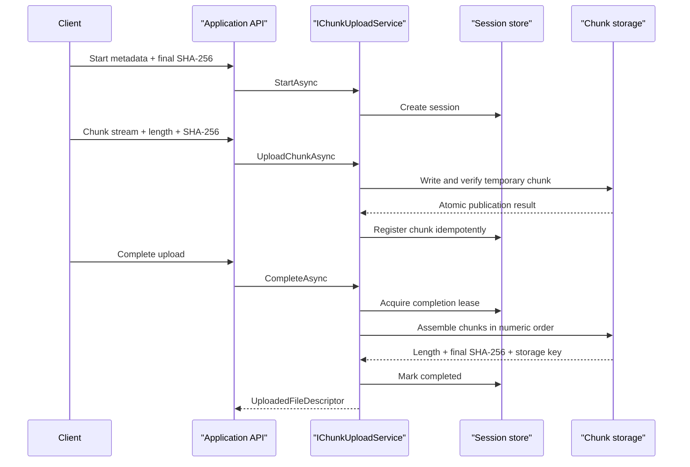
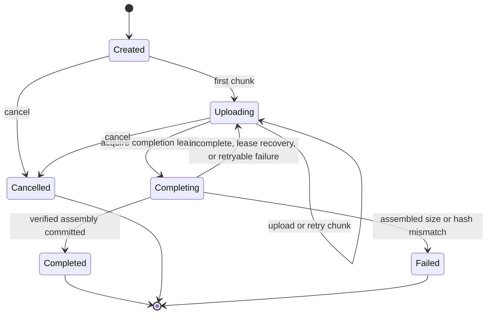

# EasyChunkUpload architecture

## Responsibility

EasyChunkUpload coordinates resumable chunk uploads and verifies their integrity while allowing the consuming application to choose its HTTP API, storage, persistence provider, and completed-file lifecycle.

## Package boundaries



| Package | Responsibility | Important public surface |
|---|---|---|
| `EasyChunkUpload.Abstractions` | Contracts and replaceable capabilities | `IChunkUploadService`, storage and persistence interfaces, requests, results, descriptors |
| `EasyChunkUpload` | Validation, state transitions, orchestration, metrics, and logging | `AddEasyChunkUpload`, `UploadOptions` |
| `EasyChunkUpload.Storage.FileSystem` | Atomic shared-filesystem chunk and completed-file storage | `UseSharedFileSystem`, `FileSystemStorageOptions` |
| `EasyChunkUpload.Persistence.EntityFrameworkCore` | Session metadata, chunk metadata, optimistic concurrency, and leases | `UseEntityFrameworkStore`, `UploadDbContext` |
| `EasyChunkUpload.Hosting` | Periodic cleanup and expired-lease recovery | `AddUploadMaintenanceWorker`, `UploadMaintenanceOptions` |

Implementation types are internal. Consumers interact through the public contracts and registration extensions.

## Runtime flow



Storage publication happens before chunk metadata registration. If the session changes during registration, the core removes a newly created chunk where safe. Existing matching chunks remain idempotent.

## State machine



The persistence coordinator owns the atomic state and lease transitions. Adapters must not infer state only from files on disk.

## Filesystem layout

The built-in adapter derives all paths from the upload ID, never from the user-provided filename.

```text
<root>/
├── chunks/
│   └── <upload-id-n>/
│       ├── 00000000.chunk
│       └── 00000001.chunk
└── completed/
    └── <upload-id-n>/
        └── content
```

Temporary files use unique `.part` names inside the destination directory so publication can use an atomic rename on the same filesystem.

## Persistence model

`UploadDbContext` maps two tables. Internal timestamps are stored as UTC `DateTime` values so relational providers, including SQLite, can translate expiration and lease comparisons consistently.

- `EasyChunkUploadSessions`: metadata, state, timestamps, expiration, storage key, lease data, and concurrency version.
- `EasyChunkUploadChunks`: one row per `(UploadId, ChunkIndex)` containing length, SHA-256, and creation time.

The composite chunk key enforces one metadata record per chunk index. The application owns the provider configuration and migrations.

## Completion and recovery

1. An instance acquires an expiring completion lease.
2. It verifies that indexes `0..TotalChunks - 1` exist and lengths add up to the declared file length.
3. Storage assembles chunks through streaming I/O and returns the observed length and SHA-256.
4. Core compares both values with the session declaration.
5. Persistence atomically commits the completed descriptor only if the same lease is still owned.

If an instance stops during completion, maintenance recovers the expired lease and returns the session to an uploadable state. Atomic storage publication prevents a partially assembled file from becoming the completed object.

## Maintenance

The hosted worker creates a dependency-injection scope for each cycle and calls `IUploadMaintenanceService`.

- Incomplete sessions are candidates only after `ExpiresAt <= UtcNow`.
- Cleanup acquires a lease before deleting artifacts.
- Failure of one candidate does not stop the remaining batch.
- Completed files are not subject to automatic retention.

Applications with an external scheduler can omit `EasyChunkUpload.Hosting` and invoke `IUploadMaintenanceService.RunOnceAsync` themselves.

## Adapter rules

### Custom storage

An `IChunkStorage` implementation must:

- Stream content and honor cancellation.
- Enforce expected length and SHA-256.
- Publish chunks and completed objects atomically or with equivalent visibility guarantees.
- Return matching existing chunks as idempotent success and different content as conflict.
- Assemble in numeric chunk order.
- Keep deletion idempotent.
- Return an opaque storage key rather than an infrastructure path or credential-bearing URL.

### Custom persistence

`IUploadSessionStore` and `IUploadCompletionCoordinator` must be implemented as a coordinated pair. They must provide:

- Unique `(UploadId, ChunkIndex)` registration.
- Optimistic concurrency or equivalent compare-and-swap behavior.
- Exclusive expiring leases for completion and cleanup.
- Lease-owner validation when committing or releasing work.
- Lease renewal for completion and cleanup work that can outlive the initial lease.
- Owner-conditional cleanup finalization.
- Maintenance candidate selection based on expiration, not creation time alone.
- Purging of cleaned incomplete-session metadata after the configured retention period.

Test custom adapters with multiple service providers sharing the same real backing services. In-memory tests alone cannot establish distributed-safety guarantees.
